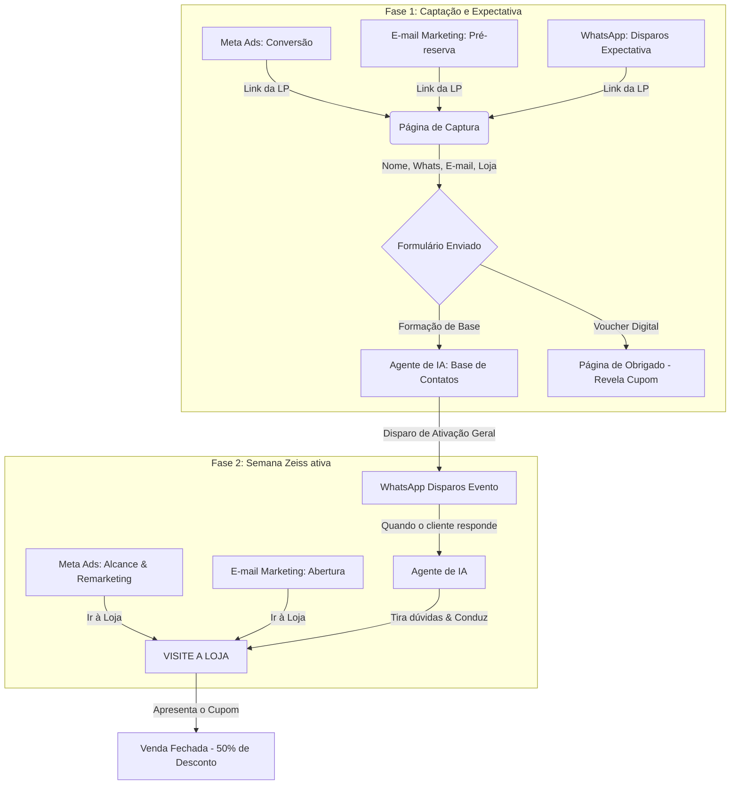

# Planejamento Estratégico: Semana Zeiss 2026
**Cliente:** Grupo Emerson (Lojas Zeiss e Lojas QualiÓtica)  
**Agência:** White Window  
**Escopo:** Tráfego Pago (Meta Ads), Landing Pages, Disparos WhatsApp/E-mail, Integração do Agente de IA (Versão Ótica).

---

## Campanha Semana Zeiss

A Semana Zeiss é o principal evento comercial do ano letivo de varejo óptico para o parceiro Emerson, proprietário de unidades sob duas bandeiras: **lojas Zeiss** (Zeiss Vision Center) e **lojas QualiÓtica**. 

Ambas as redes comercializam o portfólio de lentes Zeiss e aplicarão simultaneamente o desconto inédito de 50% em lentes premium da marca, democratizando o acesso a essa tecnologia de precisão.

### Diretrizes e Mecânica Comercial:
*   **Alinhamento de Lojas:** A promoção ocorre exclusivamente nas lojas físicas do Grupo Emerson (bandeiras Zeiss e QualiÓtica), onde é feito o atendimento técnico e a medição do centro óptico.
*   **Receita Médica:** O desconto é condicionado à apresentação de receita oftalmológica válida.
*   **Validação por CPF:** Limite rígido de um par de lentes promocionais por CPF cadastrado no caixa no ato da compra para garantir o benefício ao consumidor final.

---

## Fase 1: Captação e Expectativa (Pré-Campanha)

Foco em represamento de demanda e geração de base de leads (pré-reservas) antes do evento.

### Canais de Tráfego:
*   **Meta Ads:** Anúncios focados em curiosidade (divulgando 50% off em lentes premium sem revelar a marca Zeiss de início), otimizados para conversão e direcionados para a Landing Page.
*   **E-mail Marketing:** Convite VIP para pré-reserva enviado a clientes históricos inativos de ambas as bandeiras.
*   **WhatsApp:** Disparos de aquecimento contendo o link da Landing Page.

### Fluxo de Cadastro e Ingestionamento:
1.  **Captura na Landing Page:** O lead acessa uma página rápida e preenche quatro campos: Nome, WhatsApp (com máscara de validação e DDD), E-mail e Loja Física de preferência (selecionando qualquer unidade Zeiss ou QualiÓtica do grupo).
2.  **Consolidação de Leads:** Dados são ingeridos na base de contatos do Agente de IA para programar a ativação.
3.  **Entrega do Voucher:** A página de obrigado revela a marca Zeiss e fornece o voucher digital de 50% de desconto.

---

## Fase 2: Semana Zeiss Ativa (Abertura e Vendas)

Migração das campanhas digitais para atração física geolocalizada e conversão presencial durante os 7 dias de promoção.

### Campanhas e Ativação:
*   **Meta Ads Hyperlocal:** Campanhas de alcance em um raio de até 3km de cada loja física Zeiss e QualiÓtica do Grupo Emerson, com botão de rota ("Como Chegar") para Google Maps/Waze.
*   **Ativação (Launch Day):** Na segunda-feira de abertura, o Agente de IA e o e-mail marketing disparam a notificação de início da campanha para os leads qualificados da Fase 1 e clientes inativos da base histórica.
*   **Fechamento:** O cliente vai à loja selecionada com o voucher digital e a receita médica para efetuar a compra presencial com validação do CPF.

---

## Arquitetura do Agente de IA

Centralização de contatos em um único Agente de IA com três atuações cronológicas na jornada:

*   **Reativação Proativa:** Reengaja contatos antigos/inativos das lojas Zeiss e QualiÓtica, direcionando-os ao cadastro da Landing Page.
*   **Ativação do Evento:** Executa o disparo em massa confirmando a abertura e a loja selecionada no dia do lançamento.
*   **Conversação, FAQ e Rotas:** Atendimento reativo automático no WhatsApp:
    *   **Tira Dúvidas Técnicas:** Explica benefícios das lentes Zeiss (**PhotoFusion X**, **UVProtect** e antirreflexo **DuraVision**).
    *   **Esclarece Regras:** Detalha os termos da promoção (receita válida, limite de 1 por CPF).
    *   **Direcionamento Geográfico:** Envia links do Google Maps com a rota exata da unidade (Zeiss ou QualiÓtica) escolhida pelo cliente.

---

## Desenho do Funil

